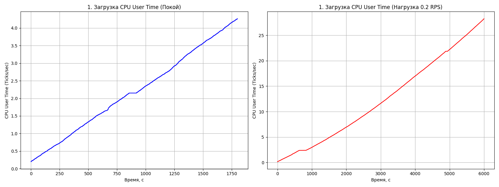
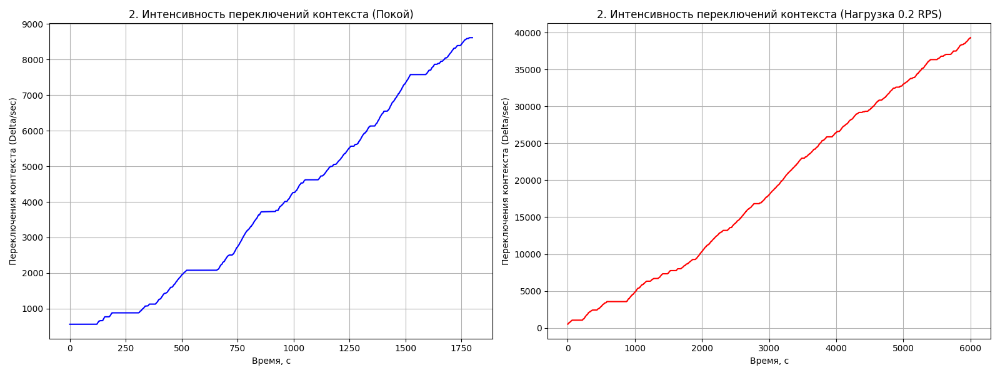
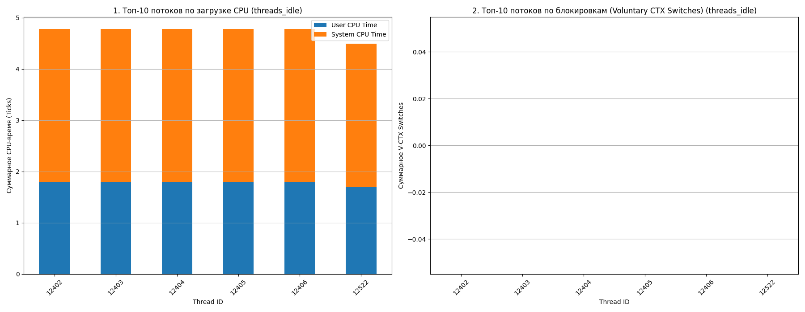
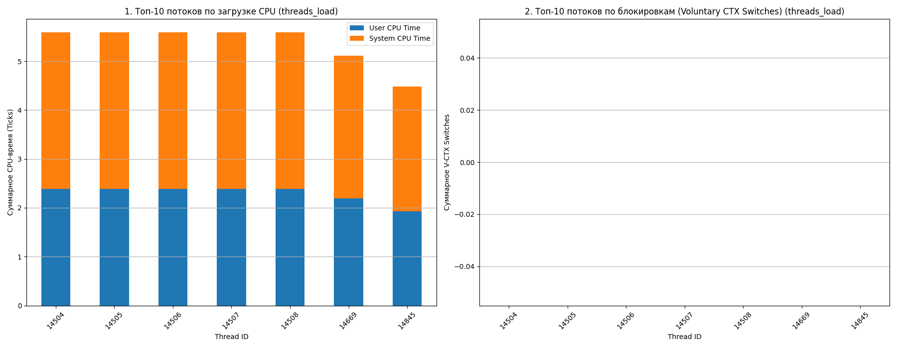
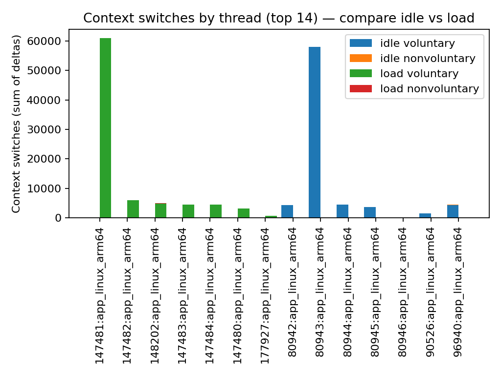
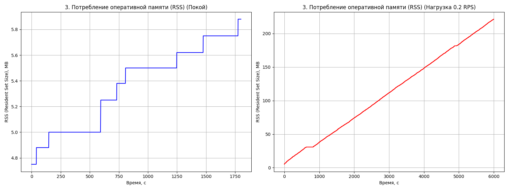
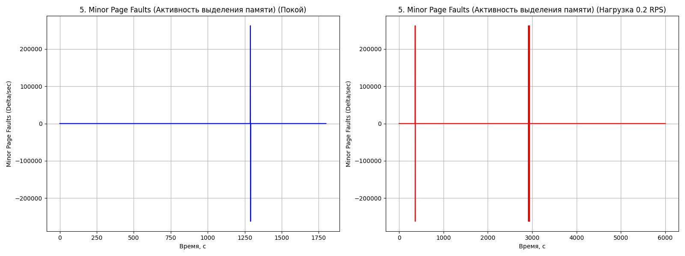
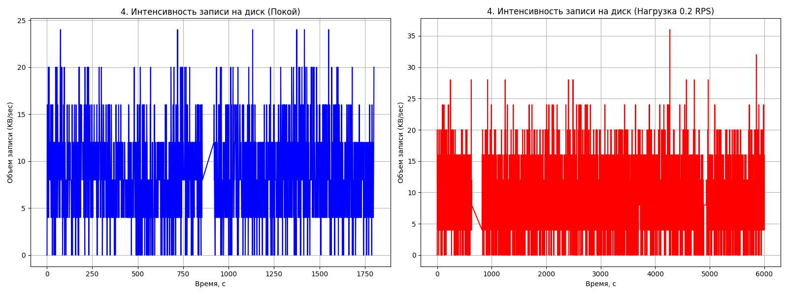
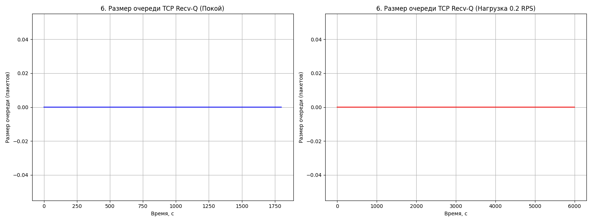

# Курс: Оптимизация программ 2025-2026
Студент: Цхай Александр

Курс: 6

---

Комплексное исследование производительности чёрного ящика

**Цель:** Идентифицировать аномалии и сформулировать гипотезы о причинах деградации производительности в приложении, работающем на `0.0.0.0:8080`, в режимах "Покой" и "Нагрузка 0.1 RPS". Для этих целей я написал несколько [скриптов](src/) на питоне и bash. В питоновском сркрипте использовал psutil для сбора метрик. Для тестов делал запросы на '/' так как на этом точно есть хэндлер (как я узнал опытным путем).

## Общие выводы
Приложение имеет **две критические проблемы**, которые проявляются даже при очень низкой нагрузке (0.1 RPS):
1.  **Критическая утечка памяти (Memory Leak):** Потребление памяти (RSS) линейно и непрерывно растет как в режиме простоя, так и под нагрузкой, но с гораздо большей скоростью под нагрузкой из-за чего приложение убивается операционной системой.
2.  **Неэффективный I/O:** Приложение постоянно и хаотично пишет данные на диск, что сопровождается частыми переключениями контекста.
3.  **Глобально видется следуюшая проблема:** Приложение хоть и использует пул из нескольких рабочих потоков, но его производительность сериализуется единственным потоком-координатором, который отвечает за медленные синхронные операции ввода-вывода (например, запись логов или данных на диск). Высокое количество добровольных переключений контекста (V-CTX) на этом потоке является прямым доказательством того, что он проводит большую часть времени в ожидании завершения I/O от ядра, что, в свою очередь, задерживает весь остальной рабочий пул.

---

## I. Анализ по CPU и потокам

### 1. Загрузка CPU User Time

* **Покой:** `CPU User Time` монотонно растет, достигая ~4.2 Ticks/сек за ~1800 секунд. Это означает, что приложение даже в состоянии покоя **активно выполняет код** (например, внутренний таймер, сборку мусора, или неэффективный цикл с ожиданием чего-то), а не простаивает. Соответсвенно даже в фоне греет проц.
* **Нагрузка (0.1 RPS):** Рост User Time значительно ускоряется, достигая ~27 Ticks/sec за 6000 секунд. Линейный характер роста свидетельствует о **стабильном, но высоком расходе CPU** на обработку запросов и фоновой активности.

### 2. Интенсивность переключений контекста

* **Покой:** Количество переключений контекста растет линейно, достигая ~8500 Delta/sec. Это **чрезвычайно высокий показатель для простаивающего процесса**, слушающего один сокет. Это указывает на активное использование примитивов синхронизации (мьютексов, семафоров), **частые блокировки** или активную работу фоновых потоков (например, сборщик мусора или метрики).
* **Нагрузка (0.1 RPS):** Рост ускоряется, достигая ~40 000 Delta/sec. В режиме нагрузки рост переключений лишь **усугубляет** базовую проблему блокировок, унаследованную от режима покоя.

### 3. То же самое в разрезе потоков

* **Покой:** Первый график показывает, что во время простоя, время процессора распределяется равномерно между потоками. Но при этом так же видим (по 3 графику) что один из потоков намного чаще перключает контекст чем остальные, что может свидетельствовать о **фоновом процессе в одном из потоков с блокировкой либо I/O**.
* **Нагрузка (0.1 RPS):** Второй график показывает, что во время нагрузки, время процессора распределяется уже не так равномерно между потоками. Например один из потоков получает явно меньше процессорного времени чем другие потоки, что может говорить о **проблеме в архитектуре приложения**. Так же по 3 графику видно что под нагрузкой так же явно один из потоков делает намного больше переключений контекста чем другие.

### **Вывод:**
Можем построить гипотезу что высокий рост `context switches` в режиме покоя в сочетании с активным `CPU User Time` указывает на **проблему блокировок** и/или **неэффективного фонового I/O**. (Что можно проверить балгодря файлам с логами в которые пишет приложение)

---

## II. Анализ памяти и диска

### 1. Потребление оперативной памяти (RSS)

* **Покой:** RSS растет ступенчато, увеличившись с ~4.7 MB до ~5.9 MB. Ступенчатый рост характерен для приложений, использующих **сборщик мусора (GC)**, который периодически высвобождает часть памяти, но общая тенденция – **рост**.
* **Нагрузка (0.1 RPS):** Наблюдается **критический линейный рост** RSS с ~5 MB до более чем 200 MB за 6000 секунд. **Это является прямым доказательством утечки памяти (Memory Leak)**. Каждый запрос (или фоновая активность, вызванная запросом) выделяет память, которая никогда не освобождается, что является ОГРОМНОЙ проблемой для производительности.

### 2. Minor Page Faults

* График показывает **резкие вертикальные всплески** (положительные и отрицательные) с равными интервалами в обоих режимах. Я думаю что это ошибка в инструменте который я использовал для сборка (из-за нелинейного изменения счетчика между замерами), а не физическое поведение приложения. Реальный анализ Minor Page Faults требует устранения этой аномалии, но можно предположить, что они происходят синхронно с I/O или сборкой мусора.

### 3. Интенсивность записи на диск

* **Покой:** Наблюдается **хаотичная, но постоянная активность записи** на диск с пиками до 25 KB/sec. Это подтверждает гипотезу об **активном фоновом I/O** (например, постоянное синхронное логирование или запись метрик на диск).
* **Нагрузка (0.1 RPS):** Активность записи **усиливается**, достигая пиков до 35 KB/sec, что коррелирует с ростом `CPU System Time` и `Context Switches` (см. Уровень 1).

### **Вывод:**
Можем сформировать 2 шипотезы снова:
1.  Присутсвует очевиденая и критичная утечка памяти.
2.  Неэффективный фоновый дисковый ввод-вывод, который вызывает блокировки и увеличивает `system time`.

---

## III. Анализ сетевого стека и ядра

### 1. Размер очереди TCP Recv-Q

* В обоих режимах (`Покой` и `Нагрузка 0.1 RPS`) размер очереди `TCP Recv-Q` **всегда равен нулю**.
* Это означает, что **приложение успевает очень быстро вычитывать данные из сокета**.
* **Вывод:** Текущий, очень низкий уровень нагрузки (0.1 RPS) **не выявляет проблем в обработке сетевых данных** (bottleneck не находится в сетевом стеке или обработке сокета, а лежит выше, в логике приложения).

### 2. IRQ и SoftIRQ
* Графики `NET_RX` и `NET_TX` не предоставлены так как в моей виртуальной я не смог перехватить трафик... Он по какой-то причине не шел ни через один имеющийся интерфейс. При этом можно сказать что приложение не делает вызовов внешних сервисов.

### **Вывод:**
На данном этапе сетевой стек работает эффективно. Если нагрузка будет увеличена (например, до 100+ RPS), проблемы утечки памяти и I/O **резко** приведут к:
1.  Увеличению `Recv-Q` (из-за задержек GC, вызванных утечкой).
2.  Росту задержек RTT (из-за блокировок I/O).
